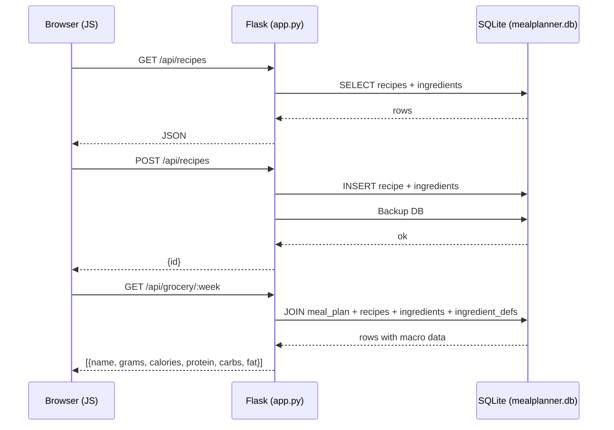
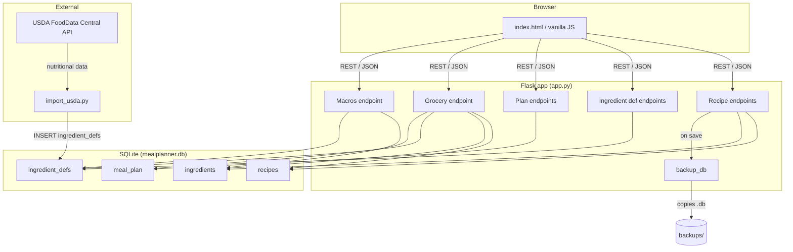
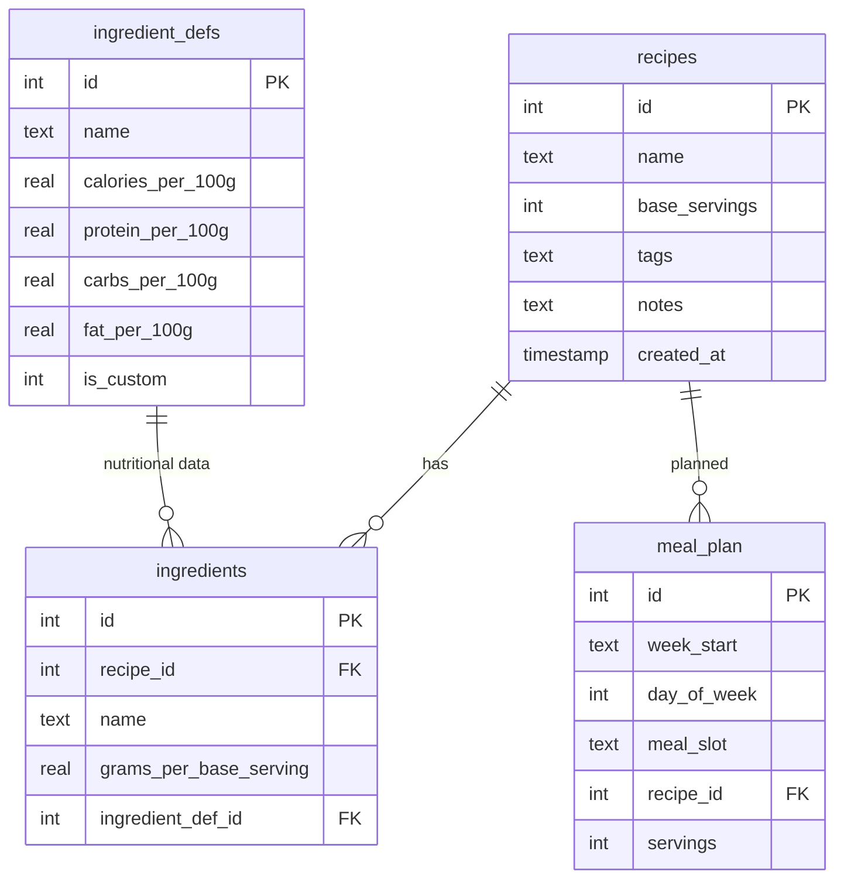

# Mise en Place — Weekly Meal Planner

A local-first web app for planning weekly meals, tracking calories and macros, and generating a grocery list. All data stays on your machine in a SQLite database.

## Quick start

```bash
pip install -r requirements.txt
python3 app.py
```

Open **http://localhost:5000**.

## Features

- **Recipe book** — Recipes with ingredients (grams per base serving), tags, and notes
- **Macros** — Calories, protein, carbs, and fat per serving pulled from USDA FoodData Central data
- **Weekly planner** — Assign recipes to days, adjust servings, navigate between weeks
- **Grocery list** — Ingredients summed across the whole week with macro totals
- **Automatic backups** — DB backed up on every server start and recipe save (last 10 kept in `backups/`)

## Importing USDA nutritional data

Get a free API key at https://fdc.nal.usda.gov/api-key-signup, then:

```bash
python3 import_usda.py --api-key YOUR_KEY

# For broader coverage (~8000 additional foods):
python3 import_usda.py --api-key YOUR_KEY --sr-legacy
```

---

## Architecture

### Request flow



### Component overview



### Data model


